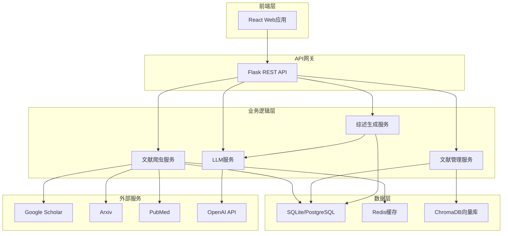

# 城市设计文献综述系统架构设计

## 一、系统概述

本系统是一个基于爬虫和LLM的智能文献综述生成应用，专门针对城市设计领域的学术研究。系统支持多数据源文献检索、智能综述生成和文献管理功能。

## 二、技术栈

### 后端技术
- **框架**: Python Flask
- **数据库**: SQLite (开发) / PostgreSQL (生产)
- **爬虫**: BeautifulSoup + Selenium + Requests
- **异步任务**: Celery + Redis
- **API文档**: Flask-RESTX (Swagger)

### 前端技术
- **框架**: React 18
- **UI组件**: Ant Design / Material-UI
- **状态管理**: Redux Toolkit
- **HTTP客户端**: Axios
- **图表**: ECharts / D3.js

### AI集成
- **LLM接口**: OpenAI兼容格式 (支持OpenAI、Azure OpenAI、本地部署模型)
- **向量数据库**: ChromaDB (用于文献相似度检索)

## 三、系统架构图



## 四、核心功能模块

### 4.1 文献爬虫模块
- **支持数据源**：
  - Google Scholar (通过scholarly库)
  - Arxiv API
  - PubMed API
  - Semantic Scholar API
  - CrossRef API

### 4.2 LLM集成模块
- **功能**：
  - 综述框架自动生成
  - 文献摘要提取和总结
  - 关键观点提炼
  - 研究趋势分析
  - 多语言翻译

### 4.3 文献管理模块
- **功能**：
  - 文献元数据存储
  - 全文PDF下载和存储
  - 引用格式生成
  - 标签和分类管理

### 4.4 综述生成模块
- **生成流程**：
  1. 关键词检索相关文献
  2. 文献去重和筛选
  3. 提取核心观点
  4. 生成综述框架
  5. 填充详细内容
  6. 格式化输出

## 五、数据模型

### 文献表 (papers)
- id: 主键
- title: 标题
- authors: 作者
- abstract: 摘要
- publication_date: 发表日期
- journal: 期刊
- doi: DOI标识
- url: 链接
- pdf_path: PDF存储路径
- source: 数据源
- citations_count: 引用数
- keywords: 关键词
- created_at: 创建时间

### 综述表 (reviews)
- id: 主键
- title: 综述标题
- keywords: 搜索关键词
- framework: 综述框架(JSON)
- content: 综述内容
- paper_ids: 引用文献ID列表
- status: 生成状态
- created_at: 创建时间
- updated_at: 更新时间

### 用户配置表 (user_config)
- id: 主键
- api_keys: API密钥配置(加密存储)
- preferences: 用户偏好设置
- created_at: 创建时间

## 六、API接口设计

### 文献搜索接口
```
POST /api/papers/search
{
    "keywords": ["城市设计", "可持续发展"],
    "sources": ["google_scholar", "arxiv"],
    "limit": 50,
    "year_from": 2020
}
```

### 综述生成接口
```
POST /api/reviews/generate
{
    "title": "智慧城市设计综述",
    "paper_ids": [1, 2, 3, ...],
    "outline_only": false,
    "language": "zh-CN"
}
```

### 文献下载接口
```
POST /api/papers/download
{
    "paper_id": 123,
    "format": "pdf"
}
```

## 七、项目目录结构

```
literature-review-system/
├── backend/
│   ├── app/
│   │   ├── __init__.py
│   │   ├── models/
│   │   ├── api/
│   │   ├── services/
│   │   │   ├── crawler/
│   │   │   ├── llm/
│   │   │   └── review/
│   │   └── utils/
│   ├── config.py
│   ├── requirements.txt
│   └── run.py
├── frontend/
│   ├── public/
│   ├── src/
│   │   ├── components/
│   │   ├── pages/
│   │   ├── services/
│   │   ├── store/
│   │   └── App.js
│   └── package.json
├── docker/
│   ├── Dockerfile
│   └── docker-compose.yml
├── docs/
└── README.md
```

## 八、部署方案

### 开发环境
- 后端: Flask开发服务器
- 前端: React开发服务器
- 数据库: SQLite

### 生产环境
- 后端: Gunicorn + Nginx
- 前端: Nginx静态文件服务
- 数据库: PostgreSQL
- 容器化: Docker + Docker Compose
- 反向代理: Nginx

## 九、安全考虑

1. **API密钥管理**：
   - 使用环境变量存储
   - 密钥加密存储在数据库
   - 支持密钥轮换

2. **访问控制**：
   - JWT令牌认证
   - API速率限制
   - CORS配置

3. **数据安全**：
   - HTTPS传输
   - 敏感数据加密
   - SQL注入防护

## 十、性能优化

1. **缓存策略**：
   - Redis缓存文献搜索结果
   - 前端本地缓存
   - CDN静态资源

2. **异步处理**：
   - Celery处理爬虫任务
   - 批量处理文献
   - 流式生成综述

3. **数据库优化**：
   - 索引优化
   - 查询优化
   - 连接池管理