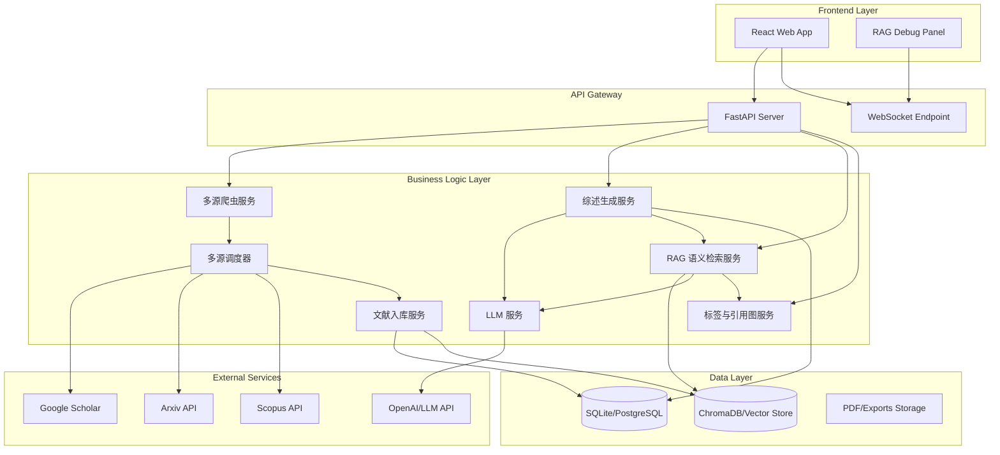

# 城市设计文献综述系统架构文档

## 1. 系统概述

本系统是一个基于爬虫和 LLM 的智能文献综述生成应用，专门针对城市设计领域的学术研究。系统支持多数据源文献检索、智能综述生成、文献管理、RAG 可视化调试以及 PhD 级多阶段综述管线。

## 2. 核心架构

系统采用前后端分离架构：

*   **前端**: React 18 + TypeScript + Vite + Ant Design
*   **后端**: Python FastAPI
*   **数据库**: SQLite (开发/测试) / PostgreSQL (生产建议)
*   **向量库**: ChromaDB (嵌入式) / FAISS
*   **任务队列**: (可选) Celery + Redis (目前主要使用后台任务 BackgroundTasks)

### 2.1 架构图

## 3. 核心模块详解

### 3.1 多源爬虫与调度系统 (Crawler & Orchestrator)

*   **BaseCrawler**: 所有爬虫的基类，定义了 `search` 和 `fetch_details` 等标准接口。
*   **具体实现**:
    *   `ArxivCrawler`: 基于 Arxiv API。
    *   `ScholarSerpAPICrawler`: 基于 SerpAPI 抓取 Google Scholar。
    *   `ScopusCrawler`: 基于 Elsevier Scopus API。
*   **MultiSourceOrchestrator**: 负责调度多个爬虫，合并结果，处理去重。
*   **Staging Area (暂存区)**:
    *   爬虫抓取的原始数据 (`SourcePaper`) 首先进入 `StagingPaper` 表。
    *   用户或自动策略审核后，从暂存区提升 (`promote`) 到正式库 (`Paper`)。

### 3.2 文献管理与入库 (Paper Ingest)

*   **PaperIngestService**: 负责将 `SourcePaper` 或 `StagingPaper` 转换为 `Paper` 模型。
*   **去重策略**: 基于 Title (归一化后) 和 DOI 进行去重。
*   **向量生成**: 入库时自动调用 `EmbeddingService` 生成标题和摘要的向量，存入 `Paper.embedding`。

### 3.3 RAG 语义检索与可视化 (RAG & Visualization)

*   **SemanticSearchService**: 核心检索服务。
    *   **Query Expansion**: 使用 LLM 扩展用户查询关键词。
    *   **Semantic Groups**: 激活相关的领域语义组 (Semantic Groups)。
    *   **Vector Search**: 基于余弦相似度在向量库中检索。
    *   **Re-ranking**: (计划中) 基于标签图和引用关系重排。
*   **WebSocket 调试**: 提供 `/ws/semantic-search` 接口，实时推送检索过程中的中间状态（扩展词、激活组、候选文献、相似度得分），供前端可视化面板展示。

### 3.4 综述生成管线 (Review Pipeline)

*   **ReviewService**: 管理综述生成流程。
*   **PhD Pipeline**: 多阶段生成策略。
    1.  **Topic Clustering**: 对检索到的文献进行聚类。
    2.  **Outline Generation**: 生成分章节大纲。
    3.  **Section Writing**: 并行或串行生成各章节内容。
    4.  **Synthesis**: 汇总生成最终综述。
*   **Prompt Engineering**: 精心设计的 Prompt 模板，注入文献元数据、摘要和统计信息。

### 3.5 标签与引用图 (Tags & Citations)

*   **Tag System**: 支持自动标签 (Auto-tagging) 和语义组 (Semantic Groups)。
*   **Citation Graph**: 存储文献间的引用关系 (`citing_paper_id` -> `cited_paper_id`)。
*   **Graph Analysis**: 利用图结构增强检索召回率 (Recall) 和发现关键文献。

## 4. 数据模型设计

主要实体关系如下：

*   **Paper**: 核心文献实体。
*   **StagingPaper**: 暂存文献实体。
*   **Review**: 综述实体，包含生成的 Markdown 内容和结构化分析数据。
*   **CrawlJob**: 爬虫任务记录。
*   **Tag/TagGroup**: 标签体系。
*   **Citation**: 引用关系。

*(详细 Schema 定义见后端代码 `backend/app/models/`)*

## 5. 部署架构

*   **容器化**: 全栈 Docker 化。
*   **编排**: Docker Compose 管理服务依赖。
*   **服务**:
    *   `backend`: FastAPI 应用。
    *   `frontend`: Nginx 托管静态资源。
    *   `db_volume`: 持久化 SQLite 数据文件。

详见 `deployment/docker-compose.yml` 和 `DEPLOY.md`。