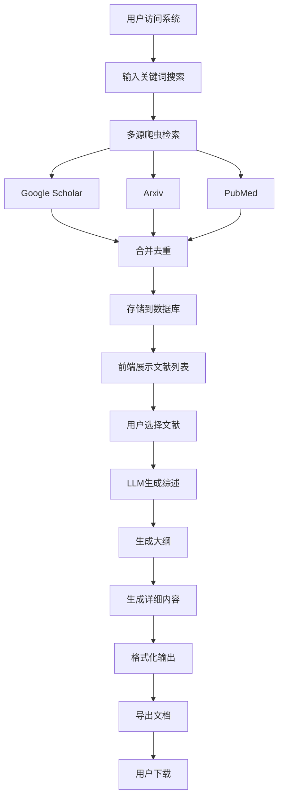
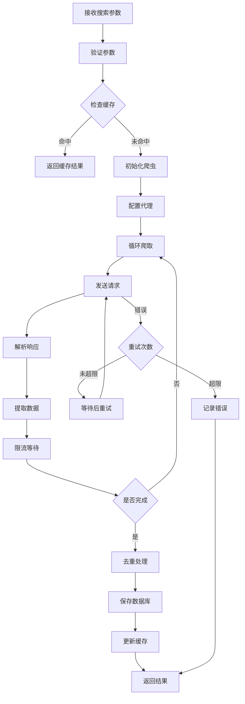
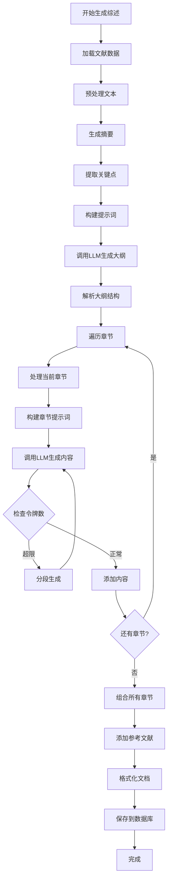
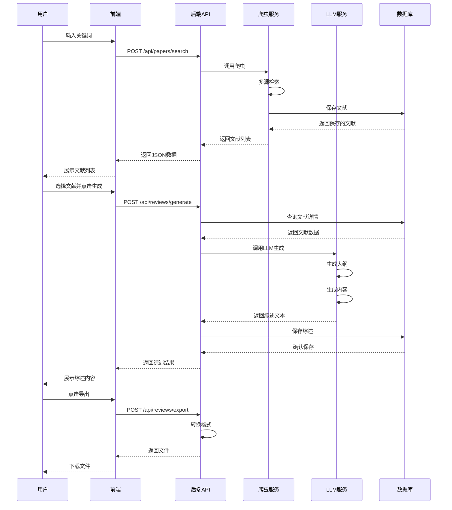
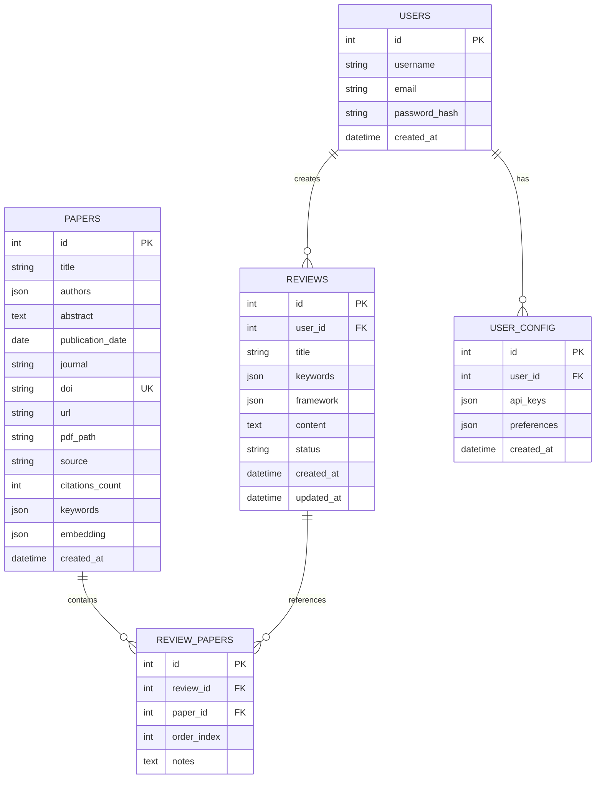
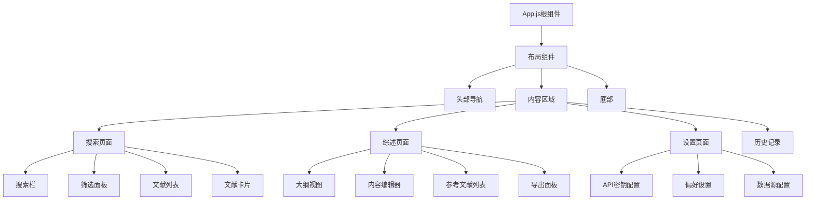
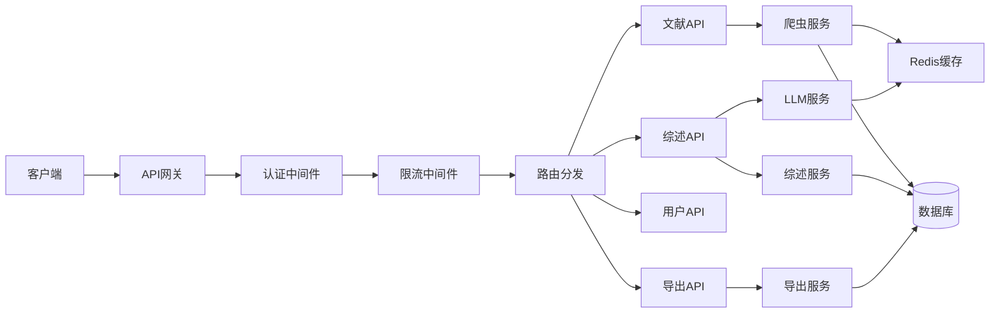
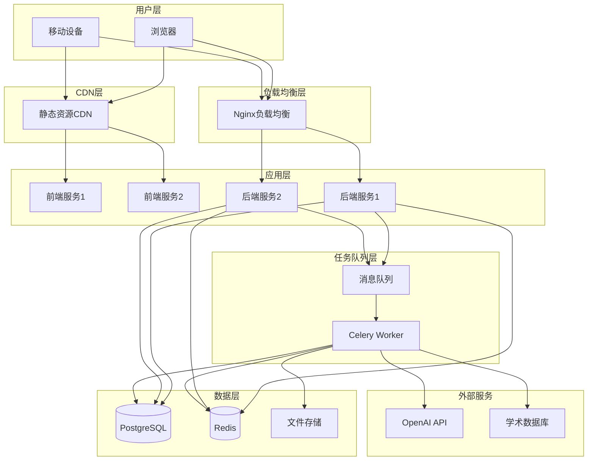
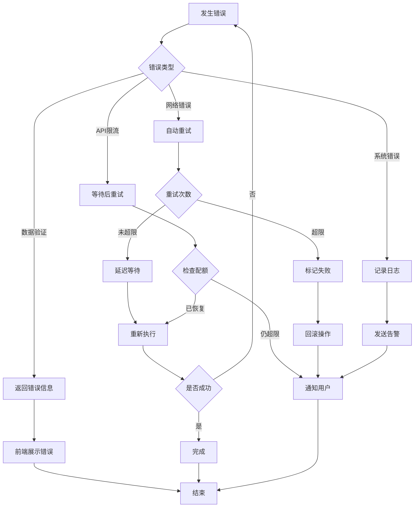
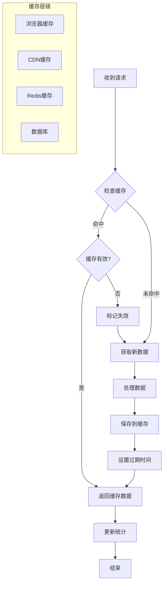

# 城市设计文献综述系统 - 工作流程图

## 1. 整体系统工作流程

## 2. 文献爬虫详细流程

## 3. LLM综述生成流程

## 4. 用户交互流程

## 5. 数据库关系图

## 6. 前端页面结构

## 7. API接口架构

## 8. 部署架构

## 9. 错误处理流程

## 10. 缓存策略

这些流程图清晰地展示了系统各个部分的工作流程和相互关系，可以帮助开发团队更好地理解系统架构。